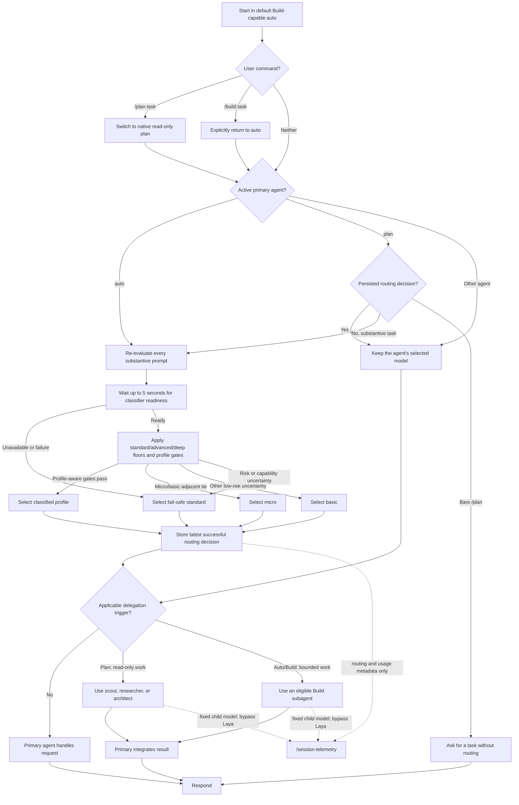

# Laya routing and subagent delegation

Laya routes the **model** for an eligible top-level session. The active primary agent separately decides whether to delegate work. Routing never changes permissions.

There is no implicit mode switch based on wording. Manual `build` and specialist agents remain outside Laya routing unless configured otherwise.

While `auto` is active, every substantive user prompt is classified independently. The router may therefore switch models between consecutive turns as task complexity or risk changes. A manual `/models` override in `auto` lasts only until the next substantive prompt. Native `plan` continues to reuse the persisted routing decision so planning follow-ups remain on one model.

## Profiles

The editable source for profile models and classifier criteria is [`laya/profiles.json`](./laya/profiles.json), loaded through the plugin's `profilesFile` option at service startup. The file must contain exactly the five profiles below. Restart the OpenCode service after changing it; invalid profile files fail explicitly instead of falling back silently.

- `micro` — `ollama/ministral-3:8b`: trivial interaction, mechanical transformation, and bounded simple file/web tool use.
- `basic` — `openai/gpt-5.6-luna#low`: simple low-risk file operations, repository discovery, straightforward web search, explanations, summaries, and drafting.
- `standard` — `openai/gpt-6-luna#medium`: routine engineering with a settled design, repository work, code changes, commands, tests, reviews, and ordinary debugging. This is also the operational fail-safe.
- `advanced` — `openai/gpt-6-sol#low`: planning, difficult implementation, multi-component reasoning, integration decisions, and nontrivial debugging. Native planning has an `advanced` minimum.
- `deep` — `openai/gpt-6-sol#high`: architecture, security, privacy, compliance, migrations, production or destructive work, distributed systems, broad high-impact work, or ambiguous root-cause debugging.

The latest successful policy or fallback decision is stored for telemetry and for non-`auto` reuse. A bare `/plan` asks for a task without consuming or replacing that decision.

Tool availability is independent of profile: `micro` and `basic` retain all tools allowed to the active agent. Simple file read/write, repository discovery, and straightforward online search do not by themselves impose a `standard` floor. Code implementation, tests, debugging, and consequential work retain higher floors. Attachments alone do not impose a `standard` floor.

## Classification scores and policy gates

Laya returns a selected profile, a `confidence` value, and a probability distribution over the five profiles. The router derives two additional values from that response:

- **Confidence** measures Laya's confidence in the classification answer as a whole. It must be at least `0.10` (`modelConfidenceThreshold`). It is distinct from the probability assigned to the selected profile.
- **Choice probability** is the probability Laya assigned to the selected profile. It must be at least `0.45` (`minimumChoiceProbability`). This prevents accepting a choice that has only weak absolute support.
- **Margin** is the highest profile probability minus the second-highest profile probability. It must be at least `0.10` (`minimumMargin`). This prevents accepting a narrow win between two nearly tied profiles.

For `micro`, calibrated distribution thresholds are intentionally lower: selected probability `0.35` (`minimumMicroChoiceProbability`) and margin `0.05` (`minimumMicroMargin`). This profile still cannot bypass any capability or risk floor.

The gates are profile-aware. `micro` requires its selected probability and margin to pass; low confidence alone does not reject it when the distribution agrees. If Laya selects `basic` but `micro` and `basic` are the two leading classes, their combined probability is at least `0.55`, and their probability gap is no more than `0.10`, the router resolves the adjacent-profile ambiguity to `micro`. Other uncertain low-risk choices fall back to `basic`. `advanced` and `deep` require all standard gates; uncertainty between them falls back no lower than `standard`. Capability floors always take precedence, and classifier/readiness failures retain the operational `standard` fallback.

For example, a `micro` choice with probability `0.52` and runner-up probability `0.35` has a margin of `0.17` and is accepted. When `basic` is selected but `micro` and `basic` together dominate the probability distribution and are close, the policy may resolve that tie to `micro`; isolated `basic` choices remain `basic`.

The score gates do not override capability and risk floors:

1. Deep-risk signals impose `deep` immediately.
2. Native planning and planning signals impose at least `advanced`.
3. Code implementation, tests, debugging, and consequential engineering operations impose at least `standard`; plain file access and information lookup do not.
4. Floors cannot be lowered by a cheaper classifier choice; an accepted higher-risk classification may raise the effective profile.
5. Without a floor, low-risk choices are gated and uncertain micro/basic choices fall back conservatively.

The current policy version is `2026-09-27-v4`. Laya health checks time out after one second, startup waits up to five seconds, and each classification request times out after three seconds. Readiness and request failures resolve to the operational `standard` fallback; score uncertainty follows the profile-aware behavior above.

## Delegation boundaries

- Native `plan` has statically enforced read-only permissions and may use only `scout`, `researcher`, and `architect`.
- `auto` is the default Build-capable primary agent. Auto/Build may use the existing Build subagent set: `scout`, `command-runner`, `micro-worker`, `implementer`, `researcher`, `debugger`, and `reviewer`.
- Child sessions bypass Laya and retain their configured subagent models. Subagents do not delegate further.
- The primary agent retains clarification, task decomposition, unresolved decisions, integration, and final verification.

Only one focused assignment is delegated at a time. The primary supplies the scope, constraints, expected output, and stopping conditions; the child must stop rather than broaden its assignment or resolve decisions reserved for the primary.

## Subagent configuration

Every subagent is configured with `mode: subagent`, an explicit model and step limit, deny-by-default permissions, and no ability to delegate. `experimental.subagent_depth` is `1`, enforcing a single child level. Child models are fixed and are not changed by Laya.

| Subagent | Fixed model | Steps | Available from | Purpose and effective permissions |
| --- | --- | ---: | --- | --- |
| `scout` | `ollama/ministral-3:8b` | 8 | Plan, Auto/Build | Literal, read-only repository discovery. May read, glob, grep, and run only read-only Git inspection commands (`status`, `diff`, `log`, `show`). Requires an exact scope, ordered steps, requested facts, output format, and stopping conditions. |
| `command-runner` | `ollama/ministral-3:8b` | 8 | Auto/Build | Runs one exact command in one exact working directory. Shell execution requires approval; Git mutations, destructive branch operations, `rm`, and `sudo` are denied. It cannot choose, alter, chain, or retry commands. |
| `micro-worker` | `ollama/ministral-3:8b` | 8 | Auto/Build | Applies a tiny deterministic edit when every file, location, and exact replacement is supplied. May read/search and edit, but cannot run commands or make design decisions. |
| `implementer` | `openai/gpt-5.6-sol#low` | 20 | Auto/Build | Implements one approved, bounded task. May read/search, edit, load skills, and request shell execution; Git mutations are denied. It must follow existing design decisions and stop if substantial discovery or an unresolved decision is required. |
| `researcher` | `openai/gpt-5.6-sol#low` | 12 | Plan, Auto/Build | Answers one focused research question using repository evidence, official documentation, or approved external evidence. May read/search, use skills, web fetch/search, and approved tool integrations; it cannot edit files or run shell commands. |
| `debugger` | `openai/gpt-5.6-sol#high` | 16 | Auto/Build | Performs evidence-based root-cause analysis for difficult, non-obvious failures. May read/search, use skills, fetch documentation, and request diagnostic shell commands; it cannot edit files or mutate Git. |
| `architect` | `openai/gpt-5.6-sol#high` | 12 | Plan only | Evaluates exceptional cross-system, security, distributed-systems, migration, or high-impact design decisions. May read/search, use skills and web sources, and inspect Git state/history; all other shell commands and all edits are denied. |
| `reviewer` | `openai/gpt-5.6-sol#low` | 12 | Auto/Build | Independently reviews completed nontrivial changes for correctness, security, regressions, tests, maintainability, and scope. May read/search and inspect Git state/history; it cannot edit files or run other shell commands. |

External-directory access is configured as `ask` for every subagent. The low-capability `scout`, `command-runner`, and `micro-worker` are literal executors and must return a blocker when their detailed inputs are incomplete. The reasoning-oriented agents may analyze within their assigned role, but they must report uncertainty and blockers rather than expanding scope.

`librarian` is not part of this delegation set: it is a separate primary Markdown-only agent, not a subagent.

## Telemetry

`/session-telemetry` (or `/session-telemetry --json`) reports the latest selected/effective profile, floor/reason/version, separate confidence/probability/margin, fallback state, and accumulated agent/model usage across the session family. It never stores prompt, message, or file content.
